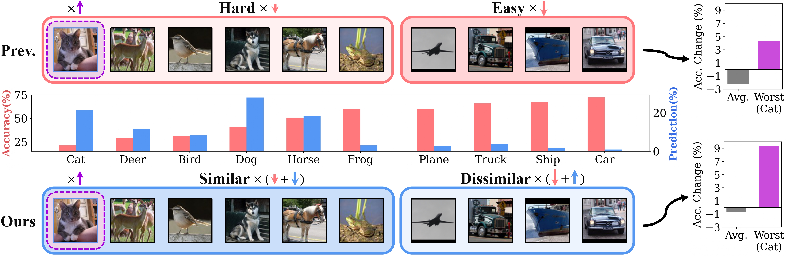
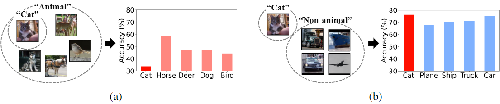
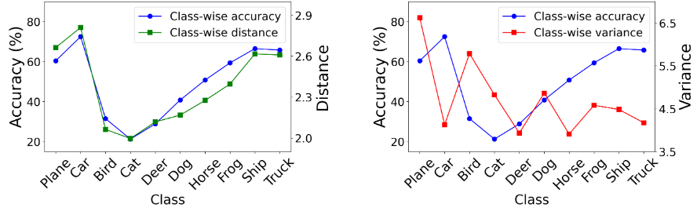
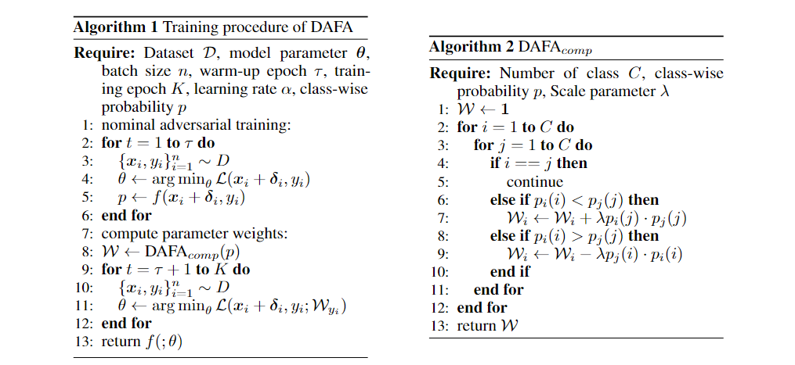
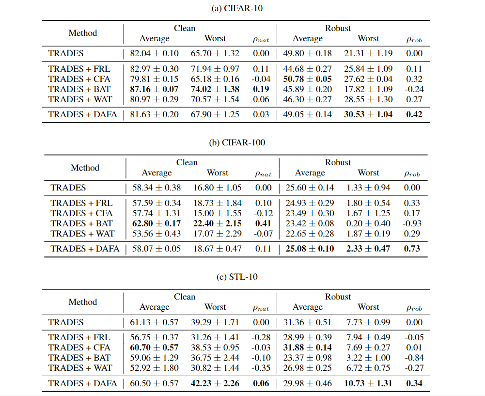

# DAFA: Distance-Aware Fair Adversarial Training

This repository contains the official implementation of "[DAFA: Distance-Aware Fair Adversarial Training](https://openreview.net/pdf?id=BRdEBlwUW6)" published at ICLR 2024.




## Abstract

The disparity in accuracy between classes in standard training is amplified during
adversarial training, a phenomenon termed the robust fairness problem. Existing
methodologies aimed to enhance robust fairness by sacrificing the model’s performance on easier classes in order to improve its performance on harder ones.
However, we observe that under adversarial attacks, the majority of the model’s predictions for samples from the worst class are biased towards classes similar to the
worst class, rather than towards the easy classes. Through theoretical and empirical
analysis, we demonstrate that robust fairness deteriorates as the distance between
classes decreases. Motivated by these insights, we introduce the Distance-Aware
Fair Adversarial training (DAFA) methodology, which addresses robust fairness
by taking into account the similarities between classes. Specifically, our method
assigns distinct loss weights and adversarial margins to each class and adjusts
them to encourage a trade-off in robustness among similar classes. Experimental
results across various datasets demonstrate that our method not only maintains
average robust accuracy but also significantly improves the worst robust accuracy,
indicating a marked improvement in robust fairness compared to existing methods.

## Getting Started

### Prerequisites

* python 3.8.18
* pytorch 1.6.0
* torchvision 0.7.0
* numpy 1.24.3

### Dataset

You can download the dataset (CIFAR-10, CIFAR-100, and STL-10) through the code of torchvision.

### Training

```
bash scripts/trades_dafa.sh     # for our method

bash scripts/trades.sh          # for baseline

Arguments:
  --model_dir                         Directory of model for saving checkpoint
  --dataset                           The dataset to use for training
  --model                             Name of the model architecture
  --loss                              Which loss to use, choices=(trades, pgd)
  --rob_fairness_algorithm            robust fairness algorithms, choices=(dafa, none)
  --dafa_warmup                       warmup epochs for dafa
  --dafa_lambda                       the value of hyperparmater lambda of dafa
```

### Evaluation
```
bash scripts/evaluation.sh

Before executing the code, correct the path of the evaluation checkpoint
After executing the code, see the PGD evaluation results through model-dir/eval_epochwise.npy
```

For autoattack evaluation, please refer to [AutoAttack](https://github.com/fra31/auto-attack) or [Adaptive AutoAttack](https://github.com/eth-sri/adaptive-auto-attack).

### Pre-trained Models

You can download pretrained models trained using our method.
Dataset | Model
------- | -----
CIFAR-10| [cifar-10.ckpt](https://drive.google.com/file/d/1JyoW2atA1hCW2jT3lZkU9CIhh_W8xiyG/view?usp=drive_link)
CIFAR-100| [cifar-100.ckpt](https://drive.google.com/file/d/1JyMgBfxMu-V-Qf7HpmuYlm8loIFReXDP/view?usp=drive_link)
STL-10| [stl-10.ckpt](https://drive.google.com/file/d/1Jv3mOmx-MFOq4yy2e0GBLR36IzKmenru/view?usp=drive_link)

## Contents of the paper

### Motivation

Our study is motivated by the observation that the prediction of the hard class is mostly misclassified as similar classes.  
  


The figure above represents the results of two 5-class classification tasks: on the left, Cat and four other animal classes, and on the right, Cat and four other non-animal classes. The results indicate that the cat class data results in the worst class accuracy on the left; however, the same cat data results in the best class accuracy on the right. This indicates that inter-class similarity plays an important role in determining the difficulty of the class in a classification task.



Additionally, we conducted an analysis to confirm the correlation between class-wise similarity (distance) and class-wise accuracy. As can be seen in the left figure below, a clear correlation between the two is observed. Furthermore, we conducted experiments to examine the correlation with the existing class difficulty indicator, class-wise variance. As evident in the left figure below, unlike class-wise distance, a clear correlation cannot be observed.  

### Method

Motivated by the above analyses, we proposed Distance-Aware Fair Adversarial Training (DAFA), which incorporates class-wise distance to bolster robust fairness.  
  


### Results  

  


## Reference
